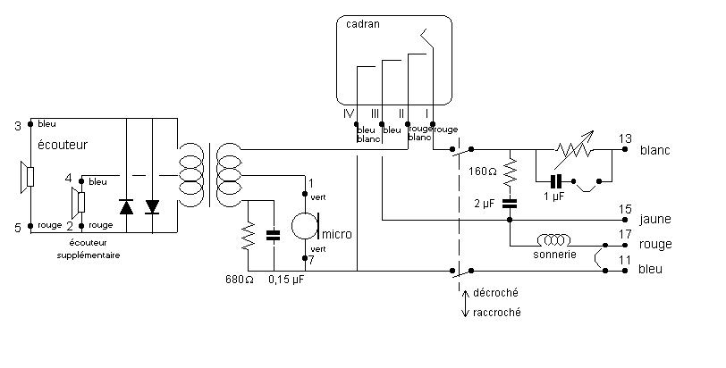
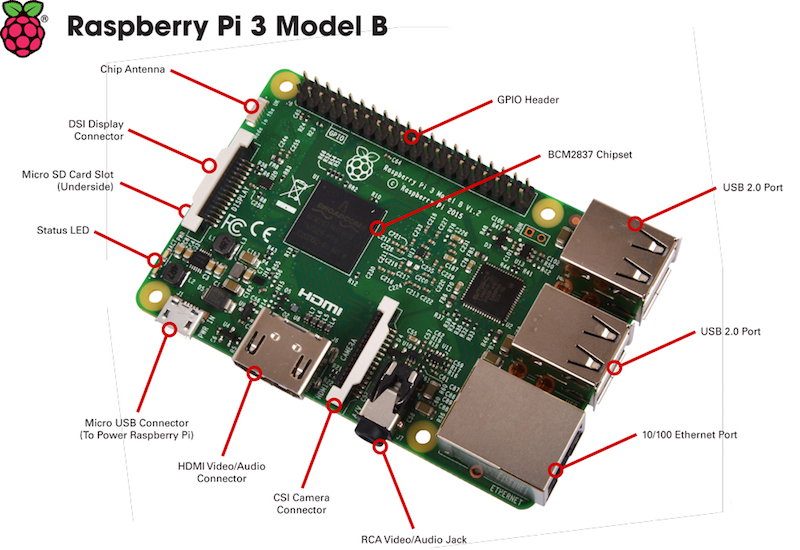
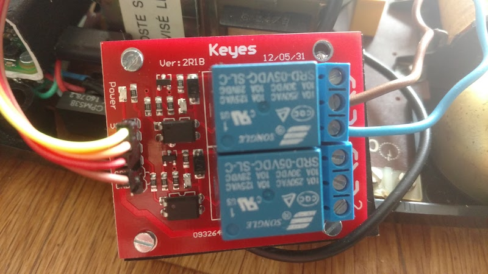
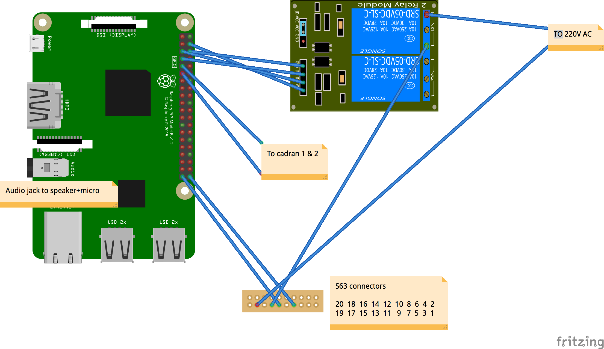
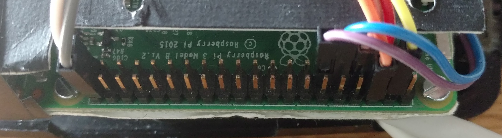
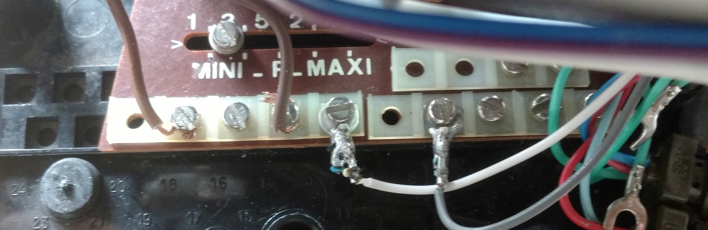

# Ressusciter un téléphone à cadran S63 avec un RaspberryPi et NodeJS

Le software c'est bien, mais couplé à du hardware c'est encore plus fun !

Ma passion pour le détournement d'objets prend de plus en plus de place, et je vais vous montrer qu'il est assez facile de détourner les objets de notre enfance pour en faire... des oeuvres d'art ! (ou pas)

Mes connaissances en éléctronique sont très limitées donc n'hésitez pas à me corriger et faire vos suggestions par email : [julien@revolunet.com](mailto:julien@revolunet.com) ou twitter : [@revolunet](http://twitter.com/revolunet).

Intéressons-nous au mythique téléphone **SOCOTEL S63**, conçu au debut des années 60, qui a été énorme un succès commercial (des dizaines de millions d'exemplaires vendus) et reste un petit bijou de l'industrie de cette époque, d'une conception simple mais très fonctionnelle et d'une durabilité impressionnante. On peut le retrouver un peu partout dans le monde et dans les brocantes pour moins de 10€.

Un autre avantage de ce modèle est que l'on peut y loger un RaspberryPi complet + ses modules sans problèmes.


Vous pouvez retrouver l'ensemble du code et du matériel sur GitHub : http://github.com/revolunet/s63


## Objectifs

L'objectif est de prendre contrôle des organes du téléphone qui nous intéressent, et de les connecter à un RaspberryPi qui vous permettra de programmer vos délires les plus fous. Dans cet exemple, on va simplement associer à certains numéros composés un fichier audio, mais de nombreuses applications sont possibles !

Voici un schema du circuit du S63 :



Ce qu'on peut voir sur ce schema :

 - La partie audio (à gauche) est isolée, sûrement pour les interférences ?
 - Les pins 13 et 17 permettent d'alimenter la sonnerie
 - Les pins 7 et 11 permettent de se connecter à l'interrupteur de décrochage
 - Le cadran peut etre connecté avec ses pins 1 et 2

Pour plus de détails vous pouvez consulter ces sites : [alain.levasseur](http://alain.levasseur.pagesperso-orange.fr/page22.htm) et [jla1313](http://jla.1313-blog.overblog.com/interface-sonnerie-pour-poste-s63)

### RaspberryPi

Le Raspberry est un mini-ordinateur sous linux, à 35€, qui permet de connecter des input/output physiques. c'est lui qui va écouter les évenements du téléphoné (décroché, composition...) et déclencher des actions : faire sonner, diffuser un son...

Il est également capable de se connecter à Internet, par RJ45, ou WiFI sur la dernière version (3B)



### Le cadran

Ce cadran rotatif est une jolie pièce de mécanique, qui convertit la rotation du cadran en un nombre d'impulsions correspondant, comme on peut le voir sur ces images (au ralenti), en bas à gauche. Il nous suffit alors de compter le nombre d'impulsions pour connaitre le numéro composé :)


Les câbles qui nous intéressent sont donc les deux à gauche : le rouge et le "rouge alterné". Je ne sais pas à quoi servent les autres.

Nous brancherons ces deux cables directement aux pins 9 (GND) et 11 (GPIO17) du RaspberryPi, lequel écoutera le nombre d'impulsions pour en déduire le numéro composé.

### Le combiné

Le combiné du S63 est un très classique haut-parleur + micro, que nous allons pouvoir brancher directement sur la sortie audio du RaspberryPi. L'ecouteur secondaire, un autre charme du S63, sera branché en parallèle.

Par chance, l'audio du RaspberryPi est juste assez puissant pour qu'on entende bien, donc pas besoin d'amplificateur audio.

### La sonnerie

La sonnerie du S63 est déclenchée par un moteur qui frappe alternativement sur 2 cloches à la fréquence de 50Hz.

Il suffirait d'alimenter ce moteur avec une tension alternative de 40 à 80V pour que cela sonne correctement. N'ayant pas trouvé de moyen simple de réduire du 220V AC en 80V AC, j'utilise le 220V directement et ca fonctionne également.

⚠️ **Ne manipulez jamais de courant 220V directement, risque d'éléctrocution fatale !** ⚠️

⚠️ **Ne branchez par le courant lorsque le capot du téléphone est ouvert** ⚠️


Nous allons utliser un module relai qui sera commandé par le RaspberryPi pour activer/désactiver le courant sur ce circuit. Le relai s'allumera et s'eteindra toutes les secondes jusqu'au décroché.



L'alimentation de la sonnerie se fait par les pins 13 et 17 du S63, que nous connecterons via la relai aux pins 7 (GPIO4), 6 (GND) et 4(VCC) du RaspberryPi.

### L'interrupteur de décroché

Lorsque l'on pose ou décroche le combiné, un interrupteur déclenche la fermeture du circuit de sonnerie.

Cet interrupteur arrive sur les pins 7 et 11 du S63 qui seront reliés aux pins 39 (GND) et 40 (GPIO21) du RaspberryPi.

## Schema du montage

Voici un schema (naïf) du montage final, réalisé avec [Fritzing](http://fritzing.org)








Raspberry Physical Pin | target | About
:----:|:----:|-----
9  | rotary red | rotary pulse
11 | rotary red/white | rotary pulse GND
4  | RELAY VCC | alim relai sonnerie
7  | RELAY R1 | active sonnerie
5  | RELAY R2 | inutilisé
6  | RELAY GND | relai sonnerie GND
40 | S63 7 | interr décroché
39 | S63 11 | interr décroché GND


Il n'y a plus que 4 cables connectés sur le header du téléphone, les autres sont directement reliés au RaspberryPi.

Et voilà pour la partie hardware !

Il ne reste plus qu'à orchestrer tout ça avec un peu de **JavaScript**.

## Software

Maintenant que nous avons branché tous les organes au RaspberryPi, il ne nous reste plus qu'à programmer le "cerveau" de notre téléphone, qui sera chargé de réagir en fonction de ce que l'on fait sur le téléphone.

Commençons par définir **exactement** ce que nous voulons faire  (les "specs") :

 - quand je décroche, je veux entendre la fameuse porteuse (c'est par convention un La à 440Hz)
 - en fonction du numéro composé sur le cadran, je veux déclencher des sons particuliers :
      - **1** : météo du jour
      - **2** : une blague
      - **3** : les news
      - **autre** : un son au hasard
 - lorsque je raccroche, les sons doivent se couper

Pour orchestrer tout cela, nous allons utiliser l'excellent framework open-source [johnny-five](https://johnny-five.io) qui permet de contrôller de nombreuses cartes hardware avec une API simple et haut-niveau.

Je vais détailler une partie du code mais le projet complet est disponible sur GitHub : http://github.com/revolunet/s63

### Préparation de la RaspberryPi

La première chose à faire est d'installer un système linux sur la RaspberryPi. Téléchargez [Raspian](https://downloads.raspberrypi.org/raspbian_lite_latest), installez-le sur une carte SD, puis [installez NVM](https://gist.github.com/revolunet/f85a6fbe8b2688632c288f26010c9542#nvm-setup) et [johnny-five](https://johnny-five.io). Plus d'infos sur ma [cheatsheet RaspberryPi](https://gist.github.com/revolunet/f85a6fbe8b2688632c288f26010c9542)

Johnny-five permet de gérer les boards (Arduino, RaspberryPi...) mais aussi tous les modules/composants que l'on peut y connecter (relais, boutons, leds...). Très bien documenté, ce framework permet de gérer facilement la plupart des composants, et de le combiner avec les dizaines de milliers de librairies open-source disponibles dans l'ecosystème JavaScript/npm.

Exemple de code minimal :

```js
// on importe les dépendances
const five = require("johnny-five");
const Raspi = require("raspi-io");

// on déclare la board
const board = new five.Board({ io: new Raspi() });

// Une fois la carte prête
board.on("ready", function() {

  // configuration du button de raccrochage du combiné
  var hangupButton = new five.Button({
    pin: "GPIO21",
    isPullup: true,
    holdtime: 10
  });

  // déclenchement lorsque l'on décroche
  hangupButton.on("up", function() {
    board.info("Phone", "PICK UP");
  });

  // déclenchement lorsque l'on raccroche
  hangupButton.on("down", function() {
    board.info("Phone", "HANG UP");
  });
});
```

Pour lancer ce code depuis la RaspberryPi, executez `node index.js` dans le terminal.

Le script doit se lancer et lorsque vous décrochez ou raccrochez le combiné vous verrez apparaitre les messages de log dans le terminal.

### Audio

NodeJS dispose de tout ce qu'il faut pour traiter de l'audio, et nous allons utiliser :

 - [node-speaker](https://github.com/TooTallNate/node-speaker) qui permet d'envoyer un stream audio PCM sur votre carte son.
 - [lame](https://github.com/TooTallNate/node-lame) play des fichiers mp3 à destination de node-speaker.
 - [node-oscillator](https://github.com/audiojs/audio-oscillator) génère des sons pour node-speaker (ex: notre porteuse).

Nous allons donc produire de l'audio en NodeJS, lequel sera envoyé dans le combiné du téléphone via la sortie audio du RaspberryPi.

#### Son de la porteuse

```js
var Speaker = require("node-speaker");
var Oscillator = require("audio-oscillator");

var speaker = new Speaker();

return Oscillator({
  frequency: 440,
  detune: 0,
  type: "sine",
  normalize: true
}).pipe(speaker);
```

Ceci crée le son de la porteuse en La 440Hz et l'envoie directement sur l'audio avec `pipe`.

Donc lorsqu'on décrochera le téléphone, on recevra l'évènement `hangupButton.on("up")`, et il faudra déclenchera cette fonction pour entendre la porteuse dans le combiné.

#### Lecture fichiers son

```js
var fs = require("fs");
var lame = require("lame");
var Speaker = require("node-speaker");

var speaker = new Speaker();
var decoder = new lame.Decoder();

fs.createReadStream("/path/to/file.mp3").pipe(decoder).pipe(speaker);
```

Ceci permet de lire un fichier mp3, de le décoder, et de l'envoyer directement sur l'audio avec `pipe`.

Lorsque l'utilisateur composera un numéro, on enverra simplement le fichier mp3 correspondant.

### Gestion du cadran

Comme expliqué plus haut, le cadran émet autant d'impulsions que le numéro composé. Il suffit donc de les compter.

A chaque numéro composé, on attends 500ms voir si l'utilisateur compose un autre numéro et sinon on décide qu'il a terminé.

 - 5 -> 5 impulsions
 - pause < 500ms
 - 3 -> 3 impulsions
 - pause < 500ms
 - 7 -> 7 impulsions
 - pause > 500ms -> terminé, numéro composé = 537

Nous pouvons représenter notre Rotary sous forme de classe, qui gerera la logique de compte et temporisation des impulsions et enverra un event `compositionend` lorsque la composition sera terminée.

Voici un exemple d'implémentation (Rotary.js) :

```js
var EventEmitter = require('events').EventEmitter;

// temps max entre deux nombres
const PULSE_TIMEOUT = 500;

// temps avant de déclencher l'évenement final avec le numéro complet
const COMPOSE_TIMEOUT = 2000;

const PULSE_VALUES = [1, 2, 3, 4, 5, 6, 7, 8, 9, 0];

class Rotary extends EventEmitter {
  constructor() {
    super()
    this.value = '';
    this.pulseCount = 0;
  }
  onPulse() {
    // reception d'une impulsion
    if (this.pulseCount === 0) {
      this.emit('compositionstart');
    }
    this.pulseCount++;
    if (this.pulseTimeout) {
      clearTimeout(this.pulseTimeout);
    }
    if (this.composeTimeout) {
      clearTimeout(this.composeTimeout);
    }
    this.pulseTimeout = setTimeout(this.onPulseTimeout.bind(this), PULSE_TIMEOUT)
  }
  onPulseTimeout() {
    // last pulse received - store number
    const num = PULSE_VALUES[this.pulseCount - 1];
    this.value += num;
    this.pulseCount = 0;
    this.composeTimeout = setTimeout(this.onComposeTimeout.bind(this), COMPOSE_TIMEOUT)
  }
  onComposeTimeout() {
    // composition timeout
    this.emit('compositionend', this.value);
    this.value = '';
    this.pulseCount = 0;
  }
}

module.exports = Rotary
```

Nous allons pouvoir utiliser cette classe dans notre programme principal :

```js
var Rotary = require("./Rotary");

// creation d'une instance de notre classe
const rotary = new Rotary();

// declaration d'un bouton qui recevra les impulsions
var rotaryButton = new five.Button({
  pin: "GPIO17",
  isPullup: true,
  holdtime: 10,
  invert: true
});

// lorsqu'on detecte une impulsion, on envoie l'info à notre classe Rotary
rotaryButton.on("up", () => rotary.onPulse());

// lorsque le rotary nous indique que la composition est terminée (timeout > 2000ms)
rotary.on("compositionend", number => {
  board.info("Rotary", `COMPOSE ${number}`);
  // on récupère le "number" entier
  // -> déclenchement du son en fonction du number
})
```

### Affectation de sons à un numéro composé

Il suffit maintenant de choisir le bon son en fonction du numéro composé.

J'ai choisi de me baser sur le FileSystem pour définir les numéros possibles et les sons à envoyer; Comme ça, pas besoin de modifier le code pour faire évoluer le plan d'appel.

Dans un dossier "plan" (comme "dial plan") nous allons créer des sous-dossiers pour chaque numéro possible. Notre code ira alors executer le fichier `index.js` s'il est présent, ou, à défaut, il ira choisir au hasard un des sons du dossier qui sera envoyé sur le haut-parleur.

Voici un extrait du code en question :

```js
// verifies si le dossier existe, sinon utilise le dossier "default"
const numberPath = (SOUNDS[number] && number) || "default";
const sounds = SOUNDS[numberPath];
// chemin vers un éventuel index.js
const modulePath = path.join(PLAN_PATH, number, 'index.js');
// execution du fichier index.js si présent
if (fs.existsSync(modulePath) && fs.statSync(modulePath).isFile()) {
  board.info("Phone", `detected index.js, execute`);
  const numberModule = require(modulePath)
  numberModule({
    playText: playText,
    playSilence: playSilence,
    playStream: playStream,
    playSine: playSine,
    hangupButton$: hangupButton$
  })
} else {
  // comportement par défaut : choisit un des mp3 au hasard dans le dossier
  const pickedSound = pickRandom(sounds);
  const sound = numberPath + "/" + pickedSound;
  if (pickedSound) {
    board.info("Phone", `START Play ${sound}`);
    // envoie le son
    playLocalSound(sound);
  } else {
    board.error("Phone", `CANNOT Play sound ${sound}`);
  }
}
```

Tout le code est disponible sur GitHub : http://github.com/revolunet/s63

### Exemple d'audio dynamique

Pour jour un fichier mp3 c'est simple, il suffit comme vu plus-haut de l'envoyer sur `node-speaker`.

Pour le cas de la météo, des blagues ou des infos, c'est un petit peu plus compliqué : il va falloir d'abord créer le fichier audio à partir de texte. Pour cela, on va d'abord récupérer des infos météo exploitables via une API, par exemple avec https://github.com/revolunet/infoclimat puis les transformer en audio avec du Text-To-Speech, par exemple avec l'API google translate.

Voici un extrait du code en question :

```js
const getUrlStream = url => fetch(url).then(res => res.body).catch(e => console.log(e));
const getTTSStream = text => getUrlStream(`http://translate.google.com/translate_tts?tl=fr&q=${encodeURIComponent(text)}&client=gtx&ie=UTF-8`);

infoclimat.getNextWeatherInFrench("48.856578,2.351828").then(text => {
  getTTSStream(text).pipe(speaker);
})
```

Avec ça vous pouvez donc créer à la volée de l'audio à partir de texte !

Exemples : [meteo](./code/plan/1/index.js) [blagues](./code/plan/2/index.js) ou [infos](./code/plan/4/index.js)

### Faire sonner le téléphone

Il nous faut pour cela activer/désactiver le relai qui laisse passer le courant (220v ⚠️) dans le circuit.

Le relai est branché en mode "Normalement Ouvert" (NO) et branché comme suit au RaspberryPi :

 - VCC : pin #4
 - R1  : pin #7
 - GND : pin #9

Il faudra un peu plus de logique pour gérer l'alternance et le décroché mais voici le fonctionnement  basique :

```js
var ringRelay = new five.Relay({
  pin: "GPIO4",
  type: "N0"
});

// ring
ringRelay.close();

// stop after 1000ms
setTimeout(ringRelay.open, 1000);
```

Voici un exemple d'implémentation de la logique de sonnerie avec [xstream](https://github.com/staltz/xstream)

**NB :** je cherche quelqu'un pour m'aider à ce sujet sur xstream/rxjs/whateverRx :)

```js
var xs = require('xstream').default;
var fromEvent = require('xstream/extra/fromEvent').default;
var delay = require('xstream/extra/delay').default;

const RING_INTERVAL = 1000;
const RING_TIMEOUT = 5000;

// pickup events stream
var pickup$ = fromEvent(hangupButton, 'up').mapTo('pickup');
// hangups events stream. drop the first one on program start;
var hangup$ = fromEvent(hangupButton, 'down').mapTo('hangup').drop(1);
// stream periodically until pickup or timeout
var ring$ = xs.periodic(RING_INTERVAL).startWith(0).endWhen(pickup$).endWhen(xs.periodic(RING_TIMEOUT).take(1));
```


### Lancement au démarrage

Pour lancer le programme NodeJs au démarrage du RaspberryPi, je vous conseille d'utiliser [pm2](https://github.com/Unitech/pm2).

## Conclusion

Il est facile de recycler d'anciens appareils et les incorporer dans vos montages; Procédez étape par étape pour comprendre et prendre le contrôle de chaque composant.

[johnny-five](https://johnny-five.io) est un outil de choix pour les makers, qui simplifie l'exploitation du RaspberryPi et permet d'accéder au formidable écosystème JavaScript qui dispose déjà de tous les outils nécessaires pour vos projets (audio, video, hardware, web...) et est parfait pour la gestion de l'asynchrone dans vos applications.


